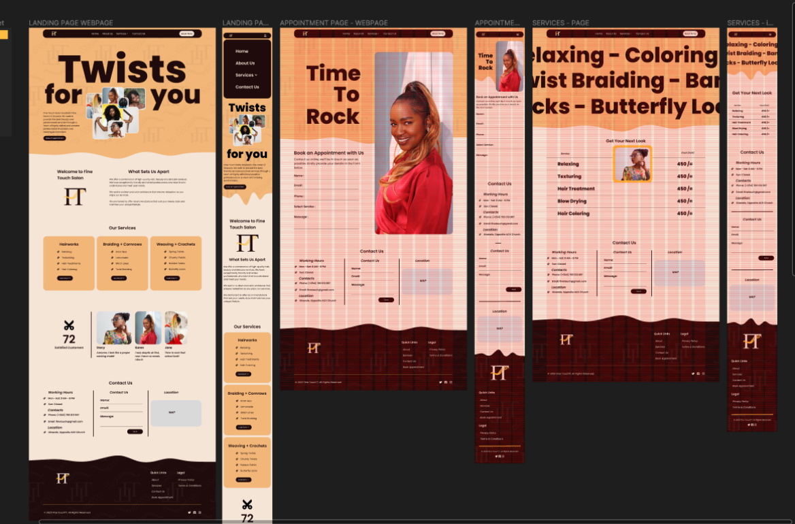

## FINE TOUCH SALON DESIGN

### Table of contents

- [Overview](#overview)
  - [Introduction](#introduction)
  - [Links](#links)
  - [Screenshot](#screenshot)
  - [Author](#author)

## Overview

### Introduction

This is a basic understanding of the process taken in building the Website.

This Repository contains the following:

1. Figma Designs - Designs for the different Web pages in Desktop and Mobile View.

**This process only covers the Desing Phases**

### Links

- Link - [Figma Designs](https://www.figma.com/file/sfHfVuCdqiYr0hbGf9o0ov/Fine-Touch-Salon?type=design&node-id=0%3A1&mode=design&t=b85a86eXiD99hvKE-1)

### Screenshot of the Figma Design

## Author

- Momanyi Brian's Website: - [Momanyi Brian](https://momanyi-brian-portfolio.vercel.app)

